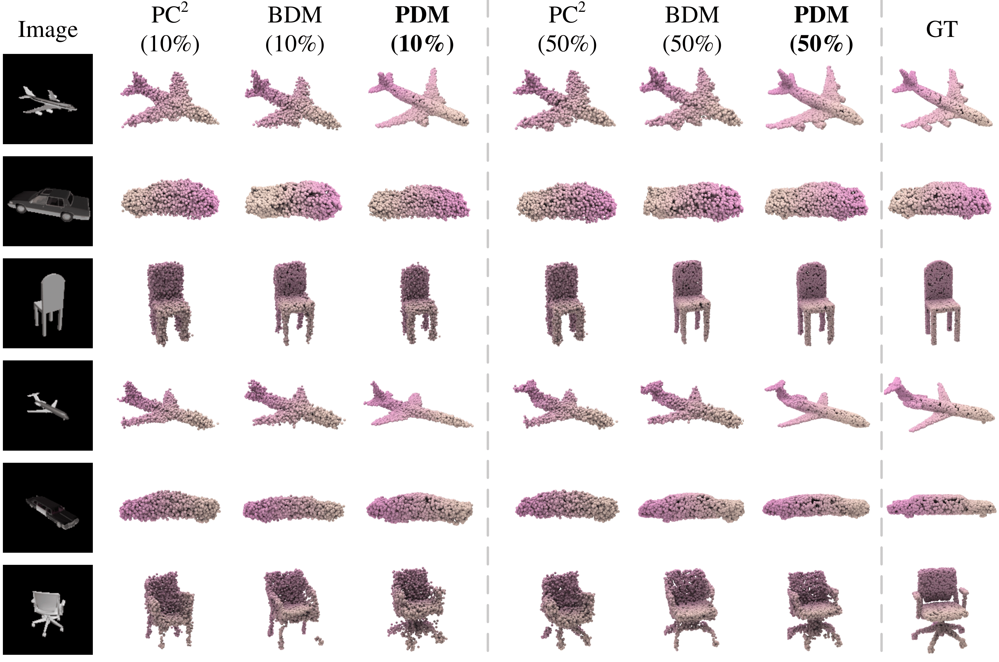
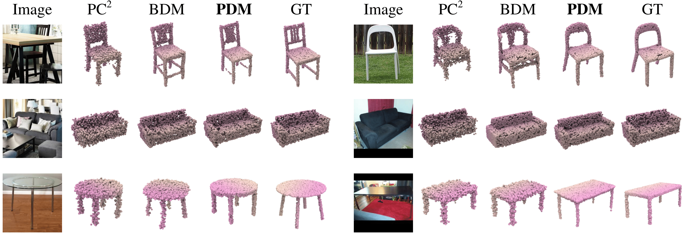
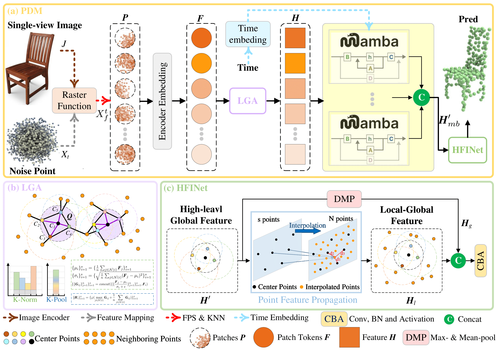

<h1 align="center">Point Diffusion Mamba</h1>

<p align="center">
  <strong>Unified Diffusion-State-Space Modeling for Single-View 3D Reconstruction under Data Scarcity</strong>
</p>

<p align="center">
  <a href="https://eccv.ecva.net/">
    
  </a>
</p>

> **Accepted at ECCV 2026**
> We are pleased to announce that this paper has been accepted to the **European Conference on Computer Vision (ECCV 2026)**.

---

## Overview

### Abstract

3D reconstruction from single-view images remains a fundamental yet notoriously challenging task in computer vision, particularly under the limited-data regime. The key difficulty lies in recovering accurate 3D structures from limited 2D observations, which often leads to ambiguity and loss of fine geometric details. To address this, we propose Point Diffusion Mamba (PDM), a new method that integrates the generative power of diffusion models with efficient state-space modeling to enhance single-view 3D reconstruction under data limitations. Specifically, PDM employs a lightweight reconstruction module designed to handle unordered point-cloud inputs effectively. By combining local geometric aggregate (LGA) with Mamba blocks, our approach captures both global geometric structures and local details. 3D reconstruction requires generating predictions for each point in the original noise, while the high-level features extracted by the Mamba module retain only abstract semantic information from sparse points. To address this issue, we propose HFINet (Hierarchical Feature Integration Network), which effectively integrates high-level features with local features for each point, thereby overcoming the limitations of token-based point-cloud reconstruction. Furthermore, we propose a dynamic weighted sampling strategy that unifies 3D generation with single-view reconstruction, leveraging generative priors to enhance reconstruction quality. Experimental results on the ShapeNet and Pix3D benchmarks demonstrate that PDM outperforms state-of-the-art methods, offering a new solution for 3D reconstruction under data-scarce conditions. We will make the source code publicly available.


### Visualization

#### ShapeNet-R2N2



#### Pix3D



## Running the Code

### Environment

1. Setting up conda environment:

```bash
# conda environment
conda create -n pdm
conda activate pdm

# python
conda install python=3.10

# pytorch
pip install torch==1.13.1+cu117 torchvision==0.14.1+cu117 torchaudio==0.13.1 --extra-index-url https://download.pytorch.org/whl/cu117

# pytorch3d
conda install -c fvcore -c iopath -c conda-forge fvcore iopath
pip install jupyter matplotlib plotly
pip install --no-index --no-cache-dir pytorch3d -f https://dl.fbaipublicfiles.com/pytorch3d/packaging/wheels/py310_cu117_pyt1131/download.html

# Mamba install
pip install causal-conv1d==1.1.1
pip install mamba-ssm==1.1.1

# Chamfer Distance & emd
cd ./extensions/chamfer_dist
python setup.py install --user
cd ./extensions/emd
python setup.py install --user
# PointNet++
pip install "git+https://github.com/erikwijmans/Pointnet2_PyTorch.git#egg=pointnet2_ops&subdirectory=pointnet2_ops_lib"
# GPU kNN
pip install --upgrade https://github.com/unlimblue/KNN_CUDA/releases/download/0.2/KNN_CUDA-0.2-py3-none-any.whl

# other dependencies
pip install -r requirements.txt
```

2. Please refer to PC^2's [common issues](https://github.com/lukemelas/projection-conditioned-point-cloud-diffusion?tab=readme-ov-file#common-issues) (2) and (3) to modify some package's source code.
3. Make sure you have gcc-8 and g++-8 installed:

```bash
apt install gcc-8
apt install g++-8
```

4. Wandb is used for logging. Please create an account and set up the API key.

### Data

#### ShapeNet-R2N2

Download [ShapeNet-R2N2](https://cvgl.stanford.edu/3d-r2n2/) (from [3D-R2N2](https://github.com/chrischoy/3D-R2N2)) and [ShapeNetCore.v2.PC15k](https://drive.google.com/drive/folders/1MMRp7mMvRj8-tORDaGTJvrAeCMYTWU2j) (from [PointFlow](https://github.com/stevenygd/PointFlow)). Unzip and put them under `experiments/data/ShapeNet/`. Then move `pc_dict_v2.json` and `pc_dict_v2.json` from `experiments/data/ShapeNet/` to `experiments/data/ShapeNet/ShapeNet.R2N2/`.

#### Pix3D

Download [Pix3D](http://pix3d.csail.mit.edu/data/pix3d.zip) (from [Pix3D](http://pix3d.csail.mit.edu/)). Unzip and put it under `experiments/data/Pix3D/`.

(We recommend to preprocess Pix3D with running `experiments/data/Pix3D/preprocess_pix3d.py` to save dataset loading time.)

After operations above, the `experiments/data/` directory should look like:

```
data
├── Pix3D
│   ├── pix3d
│   │   ├── img
│   │   ├── mask
│   │   ├── model
│   │   ├── pix3d.json
│   ├── pix3d_processed
│   │   ├── img
│   │   ├── model
│   ├── preprocess_pix3d.py
├── ShapeNet
│   ├── ShapeNetCore.R2N2
│   │   ├── ShapeNetRendering
│   │   ├── ShapeNetVox32
│   │   ├── pc_dict_v2.json
│   │   ├── R2N2_split.json
│   ├── ShapeNetCore.v2.PC15k
│   │   ├── 02691156
│   │   ├── ...
```

#### Overall Network architecture:

The network architecture of PDM is shown below:



### Training

Example of training PDM reconstruction model on 10% chair of ShapeNet-R2N2: [example_train.sh](experiments/example_train.sh).

Example of training PDM  generative mode on 10% chair of ShapeNet-R2N2: [example_train_ge.sh](experiments/example_train_ge.sh).

### Sampling

Example of sampling using the  pdm  trained above: [example_sample.sh](experiments/example_sample.sh).

Example of sampling strategy using the pdm trained above: [example_sample_fusion.sh](experiments/example_sample_fusion.sh).

### Evaluation

Example of evaluating PDM chair category sampling results: [example_eval.sh](experiments/example_eval.sh).

Table 1: Performance Evaluation on ShapeNet-R2N2: Chair, Aircraft, and Car.  
|method |Chair    10%|Chair    50%| Chair  100%|Airplane 10%|Airplane 50%|Airplane 100%|Car       10%|Car       50%|Car    100%|
|-------|------------|------------|------------|------------|------------|-------------|------------|------------|-----------|
|       |CD↓     F1↑ |CD↓     F1↑ |CD↓     F1↑ |CD↓     F1↑ |CD↓     F1↑ |CD↓     F1↑  |CD↓     F1↑ |CD↓     F1↑ |CD↓     F1↑|
|PC²    |97.25 0.393 |73.58 0.437 |65.57 0.464 |88.00 0.605 |76.39 0.628 |65.97 0.655  |64.99 0.524 |62.59 0.542 |64.36 0.547|
|CCD-3DR|89.79 0.418 |63.13 0.474 |58.47 0.498 |81.29 0.612 |72.46 0.635 |62.77 0.651  |63.13 0.531 |62.25 0.550 |61.88 0.562|
|BDM-M  |94.94 0.395 |71.56 0.446 |64.48 0.468 |87.75 0.604 |73.19 0.629 |65.16 0.653  |63.53 0.524 |60.71 0.549 |64.16 0.554|
|BDM-B  |94.67 0.410 |69.99 0.463 |64.21 0.485 |83.62 0.612 |68.66 0.641 |59.04 0.660  |60.48 0.539 |62.58 0.554 |65.85 0.559|
|MESC-3D|101.51 0.381|73.47 0.427 |65.69 0.458 |74.31 0.611 |51.28 0.619 |50.54 0.714  |56.28 0.522 |44.48 0.532 |51.99 0.602|
|PDM    |82.41 0.419 |68.85 0.465 |62.14 0.488 |60.64 0.614 |50.14 0.663 |48.66 0.719  |55.23 0.542 |55.53 0.558 |51.54 0.607|

Table 2: Performance Evaluation on Pix3D Chairs, Sofas, and Tables.  
| Method         | Chair          | Sofa           | Table          |
|----------------|----------------|----------------|----------------|
|                | CD↓     F1↑    | CD↓     F1↑    | CD↓     F1↑    |
| PC² (2023)     | 115.94  0.443  | 47.17   0.445  | 202.77  0.397  |
| CCD-3DR (2023)| 111.42  0.456  | 44.91   0.450  | 196.28  0.418  |
| BDM-M (2024)   | 113.40  0.449  | 44.50   0.451  | 202.08  0.413  |
| BDM-B (2024)   | 110.60  0.455  | 45.05   0.455  | 186.46  0.429  |
| MESC-3D (2025) | 91.36   0.370  | 41.98   0.284  | 206.16  0.306  |
| PDM            | 79.28   0.499  | 41.43   0.463  | 184.35  0.422  |

Table 3: Ablation Study on Model Architecture and Input Patch Sequence Length.  Left: Examines the effects of various modules. Right: Investigates the impact of input sequence lengths (ranging from 32 to 384).  
| Method          | F1↑    | CD↓    | Input Size | F1↑    | CD↓    |
|-----------------|--------|--------|------------|--------|--------|
| W/O LGA         | 0.478  | 91.14  | 32         | 0.485  | 84.31  |
| W/O HFINet      | 0.435  | 126.57 | 64         | 0.474  | 91.15  |
| Self-Attention  | 0.481  | 85.46  | 128        | **0.499**  | **79.28**  |
| One-SSM         | 0.474  | 88.72  | 256        | 0.491  | 80.57  |
| FULL            | **0.499**  | **79.28**  | 384        | 0.487  | 82.29  |

Table 4: Ablation Study on Model Size and Sampling Strategy. Left: Evaluates the influence of varying model sizes. Right: Assesses the impact of different sampling strategies.  
| Model    | F1↑    | CD↓    | Strategy         | F1↑    | CD↓    |
|----------|--------|--------|------------------|--------|--------|
| PDM-S    | 0.479  | 90.87  | Direct Sampling  | 0.483  | 85.27  |
| PDM-B    | **0.499**  | **79.28**  | BDM Sampling     | 0.492  | 80.23  |
| PDM-L    | 0.492  | 80.23  | Our Sampling     | **0.499**  | **79.28**  |


## Acknowledgement

Our code is built upon [Pytorch3D](https://github.com/facebookresearch/pytorch3d), [diffusers](https://github.com/huggingface/diffusers) and [bdm](https://github.com/mlpc-ucsd/BDM). We thank all these authors for their nicely open sourced code and their great contributions to the community.

## 

