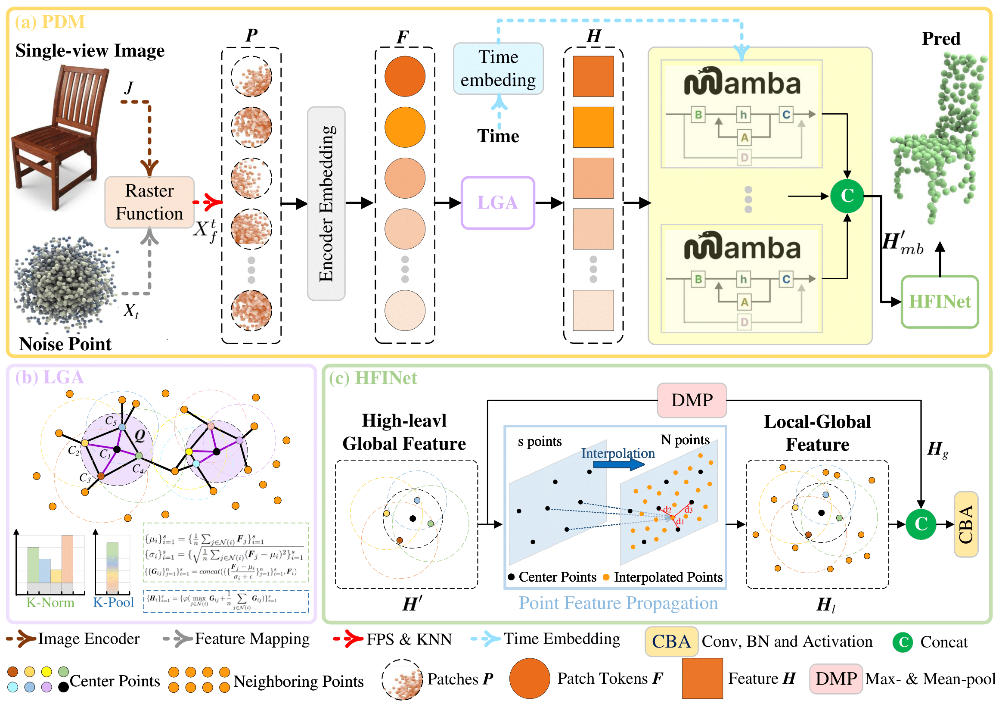

## Point Diffusion Mamba (PDM) for Single-View Point Cloud Reconstruction


## Overview

### Abstract

In computer vision and graphics, 3D point cloud reconstruction encounters significant challenges under high-resolution demands and limited data conditions. To address this issue, we propose the Point Diffusion Mamba Model (PDIM), which integrates the generative power of diffusion models with efficient state space modeling to enhance 3D reconstruction performance in single-view scenarios. The PDIM framework employs a lightweight reconstruction module to handle unordered point cloud inputs effectively. By combining Local Geometric Aggregation (LGA) and Mamba blocks, it achieves accurate capture of global geometric structures and local details. To address the limitation of high-level features from Mamba modules in precise reconstruction, we develop HFINet (Hierarchical Feature Integration Network) to fuse multi-level features for improved accuracy. Additionally, we propose a dynamic weighted sampling strategy that unifies 3D generation with single-view reconstruction, leveraging generative priors to significantly enhance reconstruction quality. Experimental results demonstrate that PDIM outperforms state-of-the-art methods on ShapeNet and Pix3D benchmarks for single-view 3D reconstruction, offering a new solution to address the challenges of high-resolution reconstruction under data scarcity.


### Visualization

#### ShapeNet-R2N2


#### Pix3D


## Running the Code

### Environment

1. Setting up conda environment:

```bash
# conda environment
conda create -n pdm
conda activate pdm

# python
conda install python=3.10

# pytorch
pip install torch==1.13.1+cu117 torchvision==0.14.1+cu117 torchaudio==0.13.1 --extra-index-url https://download.pytorch.org/whl/cu117

# pytorch3d
conda install -c fvcore -c iopath -c conda-forge fvcore iopath
pip install jupyter matplotlib plotly
pip install --no-index --no-cache-dir pytorch3d -f https://dl.fbaipublicfiles.com/pytorch3d/packaging/wheels/py310_cu117_pyt1131/download.html

# Mamba install
pip install causal-conv1d==1.1.1
pip install mamba-ssm==1.1.1

# Chamfer Distance & emd
cd ./extensions/chamfer_dist
python setup.py install --user
cd ./extensions/emd
python setup.py install --user
# PointNet++
pip install "git+https://github.com/erikwijmans/Pointnet2_PyTorch.git#egg=pointnet2_ops&subdirectory=pointnet2_ops_lib"
# GPU kNN
pip install --upgrade https://github.com/unlimblue/KNN_CUDA/releases/download/0.2/KNN_CUDA-0.2-py3-none-any.whl

# other dependencies
pip install -r requirements.txt
```

2. Please refer to PC^2's [common issues](https://github.com/lukemelas/projection-conditioned-point-cloud-diffusion?tab=readme-ov-file#common-issues) (2) and (3) to modify some package's source code.
3. Make sure you have gcc-8 and g++-8 installed:

```bash
apt install gcc-8
apt install g++-8
```

4. Wandb is used for logging. Please create an account and set up the API key.

### Data

#### ShapeNet-R2N2

Download [ShapeNet-R2N2](https://cvgl.stanford.edu/3d-r2n2/) (from [3D-R2N2](https://github.com/chrischoy/3D-R2N2)) and [ShapeNetCore.v2.PC15k](https://drive.google.com/drive/folders/1MMRp7mMvRj8-tORDaGTJvrAeCMYTWU2j) (from [PointFlow](https://github.com/stevenygd/PointFlow)). Unzip and put them under `experiments/data/ShapeNet/`. Then move `pc_dict_v2.json` and `pc_dict_v2.json` from `experiments/data/ShapeNet/` to `experiments/data/ShapeNet/ShapeNet.R2N2/`.

#### Pix3D

Download [Pix3D](http://pix3d.csail.mit.edu/data/pix3d.zip) (from [Pix3D](http://pix3d.csail.mit.edu/)). Unzip and put it under `experiments/data/Pix3D/`.

(We recommend to preprocess Pix3D with running `experiments/data/Pix3D/preprocess_pix3d.py` to save dataset loading time.)

After operations above, the `experiments/data/` directory should look like:

```
data
├── Pix3D
│   ├── pix3d
│   │   ├── img
│   │   ├── mask
│   │   ├── model
│   │   ├── pix3d.json
│   ├── pix3d_processed
│   │   ├── img
│   │   ├── model
│   ├── preprocess_pix3d.py
├── ShapeNet
│   ├── ShapeNetCore.R2N2
│   │   ├── ShapeNetRendering
│   │   ├── ShapeNetVox32
│   │   ├── pc_dict_v2.json
│   │   ├── R2N2_split.json
│   ├── ShapeNetCore.v2.PC15k
│   │   ├── 02691156
│   │   ├── ...
```

#### Overall Network architecture:

The network architecture of PDM is shown below:



### Training

Example of training PDM reconstruction model on 10% chair of ShapeNet-R2N2: [example_train.sh](experiments/example_train.sh).

Example of training PDM  generative mode on 10% chair of ShapeNet-R2N2: [example_train_ge.sh](experiments/example_train_ge.sh).

### Sampling

Example of sampling using the  pdm  trained above: [example_sample.sh](experiments/example_sample.sh).

Example of sampling strategy using the pdm trained above: [example_sample_blending.sh](experiments/example_sample_blending.sh).

### Evaluation

Example of evaluating PDM chair category sampling results:: [example_eval.sh](experiments/example_eval.sh).

<table>
  <tr>
    <th colspan="1" align="center"></th>
    <th colspan="1" align="center">PC^2</th>
    <th colspan="1" align="center">BDM</th>
    <th colspan="1" align="center">PDM</th>
  </tr>

  <tr>
    <td align="center">CD</td>
    <td align="center">65.57</td>
    <td align="center">64.21</td>
    <td align="center">62.14</td>
  </tr>

<tr>
    <td align="center">F1</td>
    <td align="center">0.464</td>
    <td align="center">0.485</td>
    <td align="center">0.466</td>
</tr>

</table>

## Acknowledgement

Our code is built upon [Pytorch3D](https://github.com/facebookresearch/pytorch3d), [diffusers](https://github.com/huggingface/diffusers) and [bdm](https://github.com/mlpc-ucsd/BDM). We thank all these authors for their nicely open sourced code and their great contributions to the community.

## 

